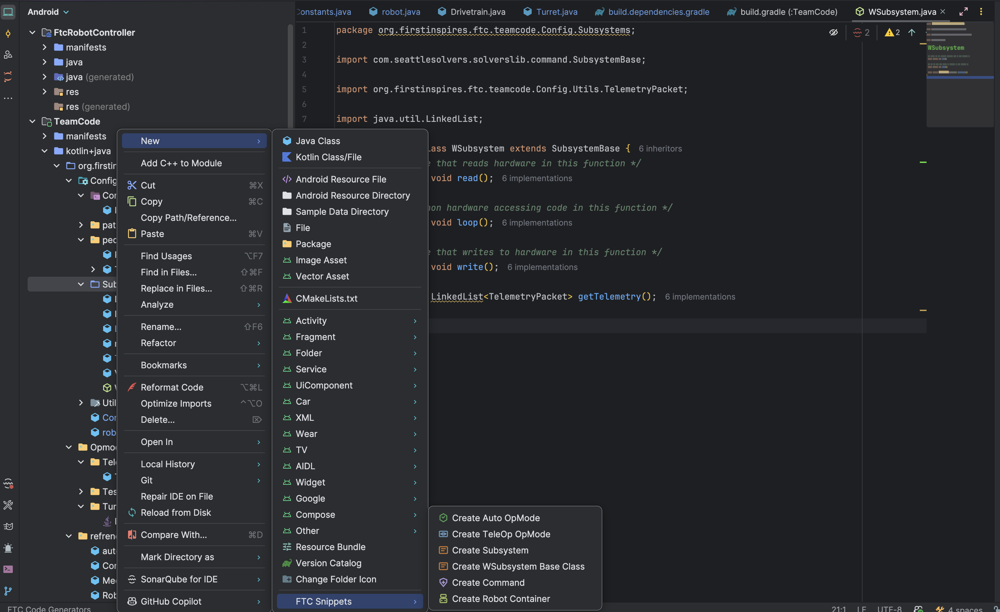

# FTC Code Snippets

A productivity plugin for **FIRST Tech Challenge (FTC)** robotics teams using IntelliJ IDEA or Android Studio.

> **Note:** This plugin currently generates templates for the [SolversLib](https://github.com/SeattleSolvers/SolversLib) command-based framework. Support for other frameworks may be added in future versions.


## Features

Generate boilerplate code quickly for **SolversLib command-based** FTC patterns:

- **Autonomous OpMode** - Create autonomous programs with pre-configured structure
- **TeleOp OpMode** - Create driver-controlled programs
- **Subsystem** - Create subsystems following the read-loop-write pattern
- **WSubsystem Base Class** - Abstract base class for the read-loop-write architecture
- **Command** - Create commands for structured robot control
- **Robot Container** - Create robot container classes

### Language Support

- **Java** templates
- **Kotlin** templates
- Configurable default language preference in settings

## Installation

### From JetBrains Marketplace

1. Open IntelliJ IDEA or Android Studio
2. Go to **Settings/Preferences** → **Plugins** → **Marketplace**
3. Search for "FTC Code Snippets"
4. Click **Install**
5. Restart the IDE

### Manual Installation

1. Download the latest release `.zip` file from [Releases](https://github.com/cohenhill/FTC_Code_Snippets/releases)
2. Go to **Settings/Preferences** → **Plugins**️ → **Install Plugin from Disk...**
3. Select the downloaded `.zip` file
4. Restart the IDE

## Usage

1. Right-click in the **Project** view on a directory
2. Select **New** → **FTC Snippets**
3. Choose the template type you want to create
4. Enter the class name
5. The file will be generated with the appropriate boilerplate code



## Configuration

Go to **Settings/Preferences** → **Tools** → **FTC Code Snippets** to configure:

- **Preferred Language**: Choose between Java and Kotlin as the default language for generated templates

## Templates

### Subsystem (Read-Loop-Write Pattern)

The plugin encourages the read-loop-write pattern for subsystems:

```java
public class MySubsystem extends WSubsystem {
    @Override
    public void read() {
        // Read all sensor/encoder values
    }

    @Override
    public void loop() {
        // Process data, run control logic
    }

    @Override
    public void write() {
        // Write outputs to hardware
    }
}
```

This pattern helps organize code and ensures consistent timing behavior.

## Requirements

- IntelliJ IDEA 2025.1+ or Android Studio 2025.1+
- Java 21+
- [SolversLib](https://github.com/SeattleSolvers/SolversLib) added to your FTC project

## Building from Source

```bash
# Clone the repository
git clone https://github.com/cohenhill/FTC_Code_Snippets.git
cd FTC_Code_Snippets

# Build the plugin
./gradlew build

# Run a test IDE instance
./gradlew runIde
```

## Contributing

Contributions are welcome! Please feel free to submit a Pull Request.

1. Fork the repository
2. Create your feature branch (`git checkout -b feature/AmazingFeature`)
3. Commit your changes (`git commit -m 'Add some AmazingFeature'`)
4. Push to the branch (`git push origin feature/AmazingFeature`)
5. Open a Pull Request

## License

This project is licensed under the MIT License - see the [LICENSE](LICENSE) file for details.

## Acknowledgments

- [FIRST Tech Challenge](https://www.firstinspires.org/robotics/ftc) for inspiring robotics education
- [Seattle Solvers](https://github.com/SeattleSolvers) for the SolversLib command-based framework
- [JetBrains](https://www.jetbrains.com/) for the IntelliJ Platform SDK


Project Link: [https://github.com/cohenhill/FTC_Code_Snippets](https://github.com/cohenhill/FTC_Code_Snippets)
